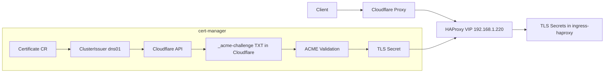

# DNS-01 with Cloudflare for k8s.rcrumana.xyz

Objective
- Issue and maintain valid TLS for:
  - k8s.rcrumana.xyz (apex)
  - *.k8s.rcrumana.xyz (wildcard)
- Keep everything declarative under Git and managed by ArgoCD.
- Work with split-horizon DNS, Cloudflare proxying, HAProxy Ingress, and MetalLB VIP 192.168.1.220.

Architecture context (what matters for DNS-01)
- Ingress
  - HAProxy Ingress LoadBalancer at 192.168.1.220 (MetalLB). See: [k8s-homelab/platform/networking/haproxy-ingress/values.yaml:6-14](k8s-homelab/platform/networking/haproxy-ingress/values.yaml:6)
  - Ingress classes: haproxy-public and haproxy-restricted. See: [k8s-homelab/platform/networking/haproxy-ingress/ingress-classes/kustomization.yaml:1](k8s-homelab/platform/networking/haproxy-ingress/ingress-classes/kustomization.yaml:1)
- Cert-manager
  - Installed via ArgoCD chart app. See: [k8s-homelab/platform/gitops/argocd/apps/cert-manager-app.yaml:1-23](k8s-homelab/platform/gitops/argocd/apps/cert-manager-app.yaml:1)
  - ClusterIssuers defined in Git, including DNS-01 solver for Cloudflare. See: [k8s-homelab/platform/networking/cert-manager/cluster-issuer.yaml:42-58](k8s-homelab/platform/networking/cert-manager/cluster-issuer.yaml:42)
- GitOps
  - Root app watches only *-app.yaml under apps/. See: [k8s-homelab/platform/gitops/argocd/apps/root-app.yaml:14-16](k8s-homelab/platform/gitops/argocd/apps/root-app.yaml:14)
  - Chart apps pin versions to avoid root OutOfSync churn. See:
    - [k8s-homelab/platform/gitops/argocd/apps/haproxy-complete-app.yaml:17-24](k8s-homelab/platform/gitops/argocd/apps/haproxy-complete-app.yaml:17)
    - [k8s-homelab/platform/gitops/argocd/apps/cert-manager-app.yaml:10-16](k8s-homelab/platform/gitops/argocd/apps/cert-manager-app.yaml:10)
    - [k8s-homelab/platform/gitops/argocd/apps/metallb-app.yaml:13-19](k8s-homelab/platform/gitops/argocd/apps/metallb-app.yaml:13)
- Cloudflare
  - Public zone hosts rcrumana.xyz.
  - Proxy (orange cloud) can remain on with DNS-01 (unlike HTTP-01).
  - API token is stored as a Kubernetes Secret (prefer SealedSecrets later). See: [k8s-homelab/secrets/cloudflare-api-token-secret.yaml:1-14](k8s-homelab/secrets/cloudflare-api-token-secret.yaml:1)

Why DNS-01 here (lessons learned)
- Wildcards require DNS-01 (Let’s Encrypt forbids HTTP-01 for *.domain).
- HTTP-01 + Cloudflare proxy often fails unless un-proxied during validation; DNS-01 does not require changes to proxying.
- The earlier “fake default certificate” was due to no cert for apex/wildcard; HAProxy fell back to its generated fake cert.

Implementation plan (declarative-first)

1) Create Cloudflare API token Secret (already in repo)
- Path: [k8s-homelab/secrets/cloudflare-api-token-secret.yaml:1-14](k8s-homelab/secrets/cloudflare-api-token-secret.yaml:1)
- Token permissions (minimum):
  - Zone Zone: Read
  - Zone DNS: Edit
- Security recommendation: replace plaintext secret with SealedSecret or SOPS post-issuance (see Security section).
- Apply path (until Argo is managing secrets path via its own Application):
  - kubectl -n cert-manager apply -f k8s-homelab/secrets/cloudflare-api-token-secret.yaml

2) Configure the DNS-01 ClusterIssuer (already in repo)
- Path includes both HTTP-01 (for non-wildcard) and DNS-01 (for Cloudflare). Ensure the DNS solver is present and references the token secret:
  - [k8s-homelab/platform/networking/cert-manager/cluster-issuer.yaml:42-58](k8s-homelab/platform/networking/cert-manager/cluster-issuer.yaml:42)
- Notes:
  - Server: production ACME endpoint is configured; use staging during initial validation if you hit rate limits.
  - Email and secret ref name must match reality.

3) Add an ArgoCD “cert-manager-extras” Application for Issuers/Certificates (recommended)
Root only loads *-app.yaml files, not raw manifests. To ensure your Issuers/Certificates are reconciled declaratively:
- Create platform/gitops/argocd/apps/cert-manager-extras-app.yaml referencing path platform/networking/cert-manager (where cluster-issuer.yaml and any certificate manifests live). Example:

apiVersion: argoproj.io/v1alpha1
kind: Application
metadata:
  name: cert-manager-extras
  namespace: argocd
spec:
  project: default
  source:
    repoURL: https://github.com/rrumana/k8s-homelab
    targetRevision: main
    path: platform/networking/cert-manager
  destination:
    server: https://kubernetes.default.svc
    namespace: cert-manager
  syncPolicy:
    automated:
      prune: true
      selfHeal: true

- Commit this file and let the root-app discover and apply it.

4) Define the wildcard Certificate (if not already)
- Recommend a clean, explicit manifest at: platform/networking/cert-manager/certificates/wildcard-k8s.yaml

apiVersion: cert-manager.io/v1
kind: Certificate
metadata:
  name: wildcard-k8s-rcrumana-xyz
  namespace: ingress-haproxy
spec:
  secretName: wildcard-k8s-rcrumana-xyz-tls
  dnsNames:
    - '*.k8s.rcrumana.xyz'
    - 'k8s.rcrumana.xyz'
  issuerRef:
    name: letsencrypt-dns-cloudflare
    kind: ClusterIssuer

- Commit this file. With step 3 in place, Argo will apply it.
- Alternative: if you keep using wildcard-default-cert-tls, ensure issuerRef uses letsencrypt-dns-cloudflare.

5) Sync and verify issuance
- Check cert-manager creates an Order and Challenges for DNS-01:

kubectl -n cert-manager get orders,challenges -A

- If none appear, verify:
  - The secret exists in cert-manager namespace.
  - The issuerRef in Certificate points to letsencrypt-dns-cloudflare exactly.
  - cert-manager controller logs for errors:

kubectl -n cert-manager logs deployment/cert-manager --tail=200

- Inspect the CertificateRequest, if present:

kubectl -n cert-manager get certificaterequest -A
kubectl -n cert-manager describe certificaterequest <name>

Expected after success:
- Certificate READY=True in ingress-haproxy:

kubectl -n ingress-haproxy get certificate

- A TLS Secret created:

kubectl -n ingress-haproxy get secret wildcard-k8s-rcrumana-xyz-tls

6) Update HAProxy default certificate to wildcard (optional, removes “fake default”)
- HAProxy currently points default-ssl-certificate at the hello-world secret. Change to wildcard after issuance:
  - [k8s-homelab/platform/networking/haproxy-ingress/values.yaml:11-14](k8s-homelab/platform/networking/haproxy-ingress/values.yaml:11)

Example change:

controller:
  config:
    ssl-redirect: "true"
    default-ssl-certificate: "ingress-haproxy/wildcard-k8s-rcrumana-xyz-tls"

- Commit and sync the HAProxy app. Confirm map:

kubectl -n ingress-haproxy exec deploy/haproxy-ingress -- cat /etc/haproxy/maps/_front_bind_crt.list

- Test TLS:

openssl s_client -connect 192.168.1.220:443 -servername k8s.rcrumana.xyz -showcerts | openssl x509 -noout -subject -issuer -dates

7) Keep per-app certs (optional) or consolidate on wildcard
- Your per-app certs via HTTP-01 are already valid:
  - argocd-server-tls, rancher-tls, hello-world-server-tls. See:
    - [k8s-homelab/platform/gitops/argocd/apps/root-app.yaml:25-52](k8s-homelab/platform/gitops/argocd/apps/root-app.yaml:25)
    - [k8s-homelab/platform/management/rancher/values.yaml:6-14](k8s-homelab/platform/management/rancher/values.yaml:6)
    - [k8s-homelab/platform/test/test-ingress.yaml:1](k8s-homelab/platform/test/test-ingress.yaml:1)
- You can migrate them to DNS-01 later by switching issuerRef to letsencrypt-dns-cloudflare if desired.

8) Testing end-to-end (Cloudflare proxied on)
- Clients see Cloudflare edge cert (expected when proxied).
- Cloudflare validates origin over TLS; ensure Cloudflare SSL mode is “Full (strict)” once origin certs are valid.
- Sanity tests:
  - curl -vk https://k8s.rcrumana.xyz/
  - Direct to VIP using SNI (bypasses Cloudflare): openssl command above.

Troubleshooting

- “using auto generated fake certificate” in HAProxy logs
  - No matching SNI cert; either the secret is missing or default certificate is not set to a valid one. Set default-ssl-certificate to the wildcard TLS secret. See: [k8s-homelab/platform/networking/haproxy-ingress/values.yaml:11-14](k8s-homelab/platform/networking/haproxy-ingress/values.yaml:11)

- Certificate shows Issuing but no Orders/Challenges
  - Issuer mismatch: issuerRef does not match the DNS-01 ClusterIssuer name.
  - Secret missing: verify cloudflare-api-token-secret exists in cert-manager namespace.
  - Retry after adding token secret: annotate or delete/recreate the Certificate.

- “no configured challenge solvers can be used for this challenge”
  - You used an HTTP-01-only issuer for a wildcard Certificate. Wildcards require DNS-01. Ensure issuerRef points to letsencrypt-dns-cloudflare. See: [k8s-homelab/platform/networking/cert-manager/cluster-issuer.yaml:42-58](k8s-homelab/platform/networking/cert-manager/cluster-issuer.yaml:42)

- ArgoCD stuck or OutOfSync loops
  - Replace=true on apps can cause delete/recreate loops; remove it. See: [k8s-homelab/platform/gitops/argocd/apps/rancher-app.yaml:27-33](k8s-homelab/platform/gitops/argocd/apps/rancher-app.yaml:27)
  - Pin chart versions (no "*"). See:
    - [k8s-homelab/platform/gitops/argocd/apps/haproxy-complete-app.yaml:17-24](k8s-homelab/platform/gitops/argocd/apps/haproxy-complete-app.yaml:17)
    - [k8s-homelab/platform/gitops/argocd/apps/cert-manager-app.yaml:10-16](k8s-homelab/platform/gitops/argocd/apps/cert-manager-app.yaml:10)
    - [k8s-homelab/platform/gitops/argocd/apps/metallb-app.yaml:13-19](k8s-homelab/platform/gitops/argocd/apps/metallb-app.yaml:13)
  - Root app should targetRevision main, not HEAD. See: [k8s-homelab/platform/gitops/argocd/apps/root-app.yaml:12](k8s-homelab/platform/gitops/argocd/apps/root-app.yaml:12)

- Rancher chart pinning fails at stable repo
  - 2.12.x is in “latest”, not “stable”. Use:
    - repoURL: https://releases.rancher.com/server-charts/latest
    - targetRevision: "2.12.0"
  - See: [k8s-homelab/platform/gitops/argocd/apps/rancher-app.yaml:15-17](k8s-homelab/platform/gitops/argocd/apps/rancher-app.yaml:15)

Security and operations

- Do not keep plaintext API tokens in Git long term
  - Bitnami SealedSecrets approach:
    - kubeseal the secret and commit the sealed manifest; remove plaintext.
  - SOPS approach:
    - Encrypt the secret file in Git and decrypt in CI/CD or ArgoCD with SOPS integration.

- Token rotation
  - Create a new Cloudflare token, update Secret, commit and sync cert-manager-extras app, annotate Certificate to force renew:

kubectl -n ingress-haproxy annotate certificate wildcard-k8s-rcrumana-xyz cert-manager.io/renew-reason=rotation --overwrite

- Observability
  - Watch cert-manager logs and resources for Orders/Challenges state.
  - Confirm HAProxy cert map updates after issuance.

Mermaid: issuance flow

Appendix: quick command set

- Check certs:

kubectl get certs -A

- Check Orders/Challenges:

kubectl -n cert-manager get orders,challenges -A

- Force re-issue:

kubectl -n ingress-haproxy annotate certificate wildcard-k8s-rcrumana-xyz cert-manager.io/renew-reason=force --overwrite

- HAProxy map:

kubectl -n ingress-haproxy exec deploy/haproxy-ingress -- cat /etc/haproxy/maps/_front_bind_crt.list

- Direct TLS test:

openssl s_client -connect 192.168.1.220:443 -servername k8s.rcrumana.xyz -showcerts | openssl x509 -noout -subject -issuer -dates