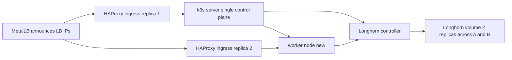

# Add a second node to k3s-homelab and validate HA and Longhorn

This runbook documents how to add a node to the existing k3s-based homelab defined in this repo, what to make declarative with ArgoCD, and how to verify high availability and data replication with Longhorn.

Current state inferred from repo:
- Kubernetes distro: k3s
- GitOps: ArgoCD with app-of-apps via [root-app.yaml](k8s-homelab/platform/gitops/argocd/apps/root-app.yaml)
- Ingress: HAProxy chart configured in [values.yaml](k8s-homelab/platform/networking/haproxy-ingress/values.yaml)
- LoadBalancer: MetalLB with pool in [ip-pool.yaml](k8s-homelab/platform/networking/metallb/config/ip-pool.yaml)
- Storage: Longhorn via ArgoCD app [longhorn-app.yaml](k8s-homelab/platform/gitops/argocd/apps/longhorn-app.yaml) with Helm values [values.yaml](k8s-homelab/platform/storage/longhorn/values.yaml)
- k3s server config exists at [config.yaml](k8s-homelab/infrastructure/k3s/config.yaml)

Key callouts discovered:
- The installed k3s path [install-k3s.sh](k8s-homelab/scripts/install-k3s.sh) installs a single server with default embedded SQLite datastore. It does not set cluster-init.
- Longhorn replicas are set to 1. After adding a node, increase to 2 to get true volume-level HA.
- HAProxy replicaCount is 2, but no anti-affinity is configured; after adding a node, spread them.

## What can be declarative vs imperative

- Node join itself is an imperative action (you must run the k3s installer on the new machine with K3S_URL and K3S_TOKEN). ArgoCD cannot join nodes.
- You can make the node bootstrap reproducible via scripts and/or Ansible committed to this repo, then invoke manually.
- Everything inside the cluster remains declarative: MetalLB, Ingress, Longhorn settings, app workloads.

Recommended places to keep declarative bits in this repo:
- Keep k3s config in [config.yaml](k8s-homelab/infrastructure/k3s/config.yaml)
- Add Ansible inventory and playbooks under [infrastructure/ansible](k8s-homelab/infrastructure/ansible)
- Manage platform components via the existing Argo apps under [platform/gitops/argocd/apps](k8s-homelab/platform/gitops/argocd/apps)

## Two paths: add a worker now, or migrate to HA control-plane

- Path A: Add a worker (agent) node. Simple, zero control-plane disruption. Application and ingress HA improve, but the API server remains a single point.
- Path B: Migrate to an HA control-plane (embedded etcd) and then add an additional server. This requires a controlled migration from SQLite to etcd or a fresh rebootstrap.

This plan delivers Path A now and outlines Path B so you can schedule it later.

## Pre-flight checks on the current server

1. Ensure the server’s firewall/network allows:
   - TCP 6443 to the server from new node
   - UDP 8472 between nodes for flannel VXLAN
   - TCP 10250 between nodes (kubelet)
   - Longhorn iSCSI traffic (TCP 3260) between nodes
2. Confirm MetalLB address pool covers expected services: see [ip-pool.yaml](k8s-homelab/platform/networking/metallb/config/ip-pool.yaml)
3. Fetch the join token on the existing server:

```bash
sudo cat /var/lib/rancher/k3s/server/node-token
```

4. Determine the K3S_URL (usually the server IP):

```bash
export K3S_URL=https://<SERVER-IP>:6443
```

## Provision the new machine from minimal Arch install

1. Base OS prep

```bash
sudo pacman -Syu --noconfirm
sudo pacman -S --noconfirm base-devel curl ca-certificates iptables-nft nfs-utils lvm2 jq
# Longhorn dependency
sudo pacman -S --noconfirm open-iscsi
sudo systemctl enable --now iscsid
# Optional but recommended
sudo pacman -S --noconfirm chrony
sudo systemctl enable --now chronyd
```

2. Kernel modules and sysctl

```bash
# iSCSI for Longhorn
echo iscsi_tcp | sudo tee /etc/modules-load.d/iscsi_tcp.conf
sudo modprobe iscsi_tcp
# Flannel VXLAN needs forwarding
echo net.bridge.bridge-nf-call-iptables=1 | sudo tee /etc/sysctl.d/99-kubernetes.conf
echo net.ipv4.ip_forward=1 | sudo tee -a /etc/sysctl.d/99-kubernetes.conf
sudo sysctl --system
```

3. Optional: set hostname and SSH keys

```bash
sudo hostnamectl set-hostname worker-1
```

4. Prepare Longhorn data path

```bash
sudo mkdir -p /srv/longhorn
sudo chown root:root /srv/longhorn
```

## Join the cluster as a worker (Path A)

On the new node:

```bash
curl -sfL https://get.k3s.io | K3S_URL=${K3S_URL} K3S_TOKEN=<PASTE_TOKEN> sh -
```

Validate:

```bash
kubectl get nodes -o wide
```

The new node should be Ready within a few minutes.

### Post-join GitOps updates

1. Increase Longhorn replica count to 2 by editing [values.yaml](k8s-homelab/platform/storage/longhorn/values.yaml)

Suggested diffs:
- defaultSettings.defaultReplicaCount: 2
- persistence.defaultClassReplicaCount: 2

Commit and let Argo sync.

2. Ensure HAProxy controller pods spread across nodes. If both replicas land on the same node, add anti-affinity or topology spread to [values.yaml](k8s-homelab/platform/networking/haproxy-ingress/values.yaml)

3. Optionally tune MetalLB speaker scheduling if needed in [values.yaml](k8s-homelab/platform/networking/metallb/values.yaml)

4. Confirm Longhorn default backup target object exists [backup-target-default.yaml](k8s-homelab/platform/storage/longhorn/prereqs/backup-target-default.yaml) and set a real target when ready.

## Optional Path B: migrate to HA control-plane with embedded etcd

Warning: moving from a single-server SQLite k3s to embedded etcd requires a controlled migration. The safest approach is a new HA bootstrap then redeploy via Argo.

High-level steps:
- Back up manifests and data, plan downtime.
- Reinstall the first server as k3s server with embedded etcd: start with cluster-init=true. You can keep your server config in [config.yaml](k8s-homelab/infrastructure/k3s/config.yaml)
- Add a virtual IP for the API server via kube-vip or an external HAProxy/keepalived so agents point at a stable endpoint.
- Join 1-2 additional servers: run installer with K3S_URL=https://<VIP>:6443 and K3S_TOKEN=<token> sh -s - server
- Point agents at the VIP.

This repo currently installs with [install-k3s.sh](k8s-homelab/scripts/install-k3s.sh) which does not set cluster-init. Treat HA migration as a separate change with a full plan and rollback.

## Validation plan

1. Platform health

```bash
kubectl get nodes
kubectl -n metallb-system get pods
kubectl -n ingress-haproxy get pods -o wide
kubectl -n longhorn-system get pods
```

2. Longhorn replication

- After Argo sync updates Longhorn to 2 replicas, create a test RWO PVC and a test pod mounting it.

```bash
cat <<EOF | kubectl apply -f -
apiVersion: v1
kind: PersistentVolumeClaim
metadata:
  name: lh-test
spec:
  accessModes:
  - ReadWriteOnce
  resources:
    requests:
      storage: 2Gi
  storageClassName: longhorn
---
apiVersion: v1
kind: Pod
metadata:
  name: lh-tester
spec:
  containers:
  - name: busybox
    image: busybox:stable
    command: [ "sh", "-c", "sleep 3600" ]
    volumeMounts:
    - name: data
      mountPath: /data
  volumes:
  - name: data
    persistentVolumeClaim:
      claimName: lh-test
EOF
```

- In Longhorn UI, confirm the volume has 2 healthy replicas on different nodes.
- Delete the node with the running pod to simulate failure:

```bash
kubectl drain <worker-node-name> --ignore-daemonsets --delete-emptydir-data --force
```

- The pod should reschedule to the other node and Longhorn should attach the volume.

3. Ingress HA

- Ensure two HAProxy pods are on different nodes. If not, add anti-affinity to [values.yaml](k8s-homelab/platform/networking/haproxy-ingress/values.yaml)
- Hit several ingress hosts and verify continuity during a node drain of one ingress pod node.

4. MetalLB

- Verify service external IPs respond after node drain; L2Advertisement [ip-pool.yaml](k8s-homelab/platform/networking/metallb/config/ip-pool.yaml) should allow peer failover.

## Risks and gotchas

- Control-plane is still single-server in Path A. Plan Path B when you need API server HA.
- Ensure CPU arch matches across nodes. k3s and Longhorn must run the same architecture images.
- Time sync is critical for etcd and TLS. Keep chrony enabled.
- Longhorn requires open-iscsi running on every node. If volumes fail to attach, check iscsid.
- If you use RWX volumes, Longhorn share-manager uses NFS; ensure nfs-utils is installed.
- For Longhorn eviction during node drain, configure PodDisruptionBudgets for stateful apps.

## GitOps and declarative bootstrap suggestions

While Argo does not enroll nodes, you can keep your bootstrap imperative steps declarative as code:
- Scripted bootstrap for servers and agents under [scripts](k8s-homelab/scripts)
- Ansible plays in [infrastructure/ansible](k8s-homelab/infrastructure/ansible) to install packages, configure kernel modules, and run the k3s installer with K3S_URL and K3S_TOKEN pulled from a vault
- A README section linking to this runbook

## Architecture diagram



## References to repo artifacts

- k3s config [config.yaml](k8s-homelab/infrastructure/k3s/config.yaml)
- k3s install script [install-k3s.sh](k8s-homelab/scripts/install-k3s.sh)
- Argo root app [root-app.yaml](k8s-homelab/platform/gitops/argocd/apps/root-app.yaml)
- Longhorn app [longhorn-app.yaml](k8s-homelab/platform/gitops/argocd/apps/longhorn-app.yaml)
- Longhorn values [values.yaml](k8s-homelab/platform/storage/longhorn/values.yaml)
- Longhorn backup target default [backup-target-default.yaml](k8s-homelab/platform/storage/longhorn/prereqs/backup-target-default.yaml)
- HAProxy values [values.yaml](k8s-homelab/platform/networking/haproxy-ingress/values.yaml)
- MetalLB values [values.yaml](k8s-homelab/platform/networking/metallb/values.yaml)
- MetalLB pool [ip-pool.yaml](k8s-homelab/platform/networking/metallb/config/ip-pool.yaml)

---

Execution checklist (high level):
- Fetch token and server IP
- Prep Arch node packages and services
- Join as worker using k3s installer
- Commit Longhorn replica changes and sync
- Spread ingress replicas
- Validate failover with drains