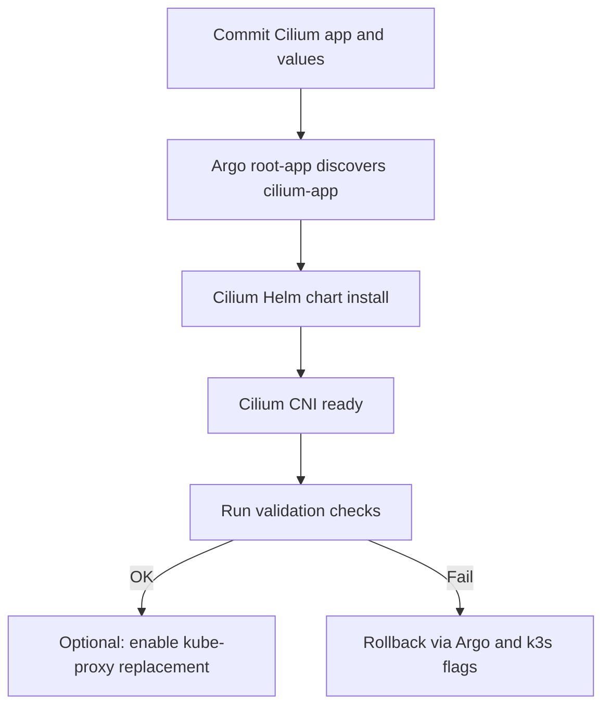

# Cilium Implementation Plan for k8s-homelab (k3s)

Goal: install and integrate Cilium as the cluster CNI to provide reliable pod-to-pod networking across nodes, with a GitOps-first rollout via ArgoCD, aligned to the existing app-of-apps pattern.

Cluster facts
- Distro: k3s v1.32.6+k3s1
- Pod CIDR: 10.42.0.0/16 (per-node /24)
- Service CIDR: 10.43.0.0/16
- Nodes: same L2 VLAN
- LoadBalancer: MetalLB (L2)
- Ingress: HAProxy

High-level approach
- Cilium v1.16.x via Helm (chart: cilium/cilium), pinned.
- Direct routing (no tunnel) because nodes share L2; enables best latency and fewer encapsulation issues.
- Stage 1: Deploy Cilium with kube-proxy retained (kubeProxyReplacement=disabled) for minimum risk.
- Stage 2 (optional): Switch to Cilium kube-proxy replacement (kubeProxyReplacement=strict) and disable kube-proxy in k3s.
- GitOps: Add an Argo Application in platform/gitops/argocd/apps, values in platform/networking/cilium.

Pre-flight checks
Run these read-only checks to confirm current state (do not commit these outputs):
1. Kube-proxy present?
   - kubectl -n kube-system get ds kube-proxy
   - kubectl -n kube-system get pods -l k8s-app=kube-proxy
2. Any existing CNI?
   - kubectl -n kube-system get ds -o wide | egrep 'flannel|calico|weave|cilium'
   - ls -la /etc/cni/net.d/ on each node (should be empty before CNI or only contain basic loopback until Cilium is installed)
3. Confirm CIDRs
   - kubectl cluster-info dump | grep -E 'cluster-cidr|service-cluster-ip-range'
4. Kernel features (eBPF and bpffs mount) typically ok on modern distros; Cilium will validate on startup.

Architecture decisions
- Mode: direct routing (tunnel: disabled), autoDirectNodeRoutes: true, endpointRoutes: true.
- IPAM: kubernetes.
- kube-proxy: start with kubeProxyReplacement: disabled; optionally move to strict after validation.
- Hubble: enable relay and UI (ingress limited to internal access).
- Metrics: enable Prometheus ServiceMonitor for Cilium and Hubble.
- MetalLB remains authoritative for external LoadBalancer IPs; no BGP needed.

Git layout to add
- platform/networking/cilium/values.yaml
- platform/networking/cilium/ingress/hubble-ui.yaml (optional)
- platform/gitops/argocd/apps/cilium-app.yaml

ArgoCD Application (app-of-apps compatible)
New Application resource. Root app picks up *-app.yaml automatically.

```yaml
apiVersion: argoproj.io/v1alpha1
kind: Application
metadata:
  name: cilium-app
  namespace: argocd
  finalizers:
    - resources-finalizer.argocd.argoproj.io
spec:
  project: default
  sources:
    - repoURL: https://helm.cilium.io
      chart: cilium
      targetRevision: 1.16.4
      helm:
        valueFiles:
          - $values/platform/networking/cilium/values.yaml
    - repoURL: https://github.com/rrumana/k8s-homelab
      targetRevision: main
      ref: values
  destination:
    server: https://kubernetes.default.svc
    namespace: kube-system
  syncPolicy:
    automated:
      prune: true
      selfHeal: true
  syncOptions:
    - CreateNamespace=true
```

Helm values (Stage 1: keep kube-proxy)
These defaults are for same-L2 nodes. Adjust resources as needed.

```yaml
cluster:
  name: homelab
  id: 1

ipam:
  mode: kubernetes

tunnel: disabled
autoDirectNodeRoutes: true
endpointRoutes:
  enabled: true

kubeProxyReplacement: disabled  # Stage 1
# For Stage 2: set to strict and disable kube-proxy in k3s

operator:
  replicas: 1
  prometheus:
    enabled: true
    serviceMonitor:
      enabled: true

hubble:
  enabled: true
  relay:
    enabled: true
  ui:
    enabled: true
    ingress:
      enabled: true
      className: haproxy-restricted
      hosts:
        - hubble.rcrumana.xyz
      tls:
        - secretName: hubble-ui-tls

prometheus:
  enabled: true
  serviceMonitor:
    enabled: true

resources:
  limits:
    cpu: 500m
    memory: 512Mi
  requests:
    cpu: 100m
    memory: 128Mi
```

Optional: Hubble UI ingress as a standalone manifest (if not managing via Helm values)

```yaml
apiVersion: networking.k8s.io/v1
kind: Ingress
metadata:
  name: hubble-ui
  namespace: kube-system
  annotations:
    cert-manager.io/cluster-issuer: letsencrypt-prod
    haproxy-ingress.github.io/whitelist-source-range: 192.168.0.0/16
spec:
  ingressClassName: haproxy-restricted
  tls:
  - hosts:
    - hubble.rcrumana.xyz
    secretName: hubble-ui-tls
  rules:
  - host: hubble.rcrumana.xyz
    http:
      paths:
      - path: /
        pathType: Prefix
        backend:
          service:
            name: hubble-ui
            port:
              number: 80
```

Stage 2 values (if adopting eBPF kube-proxy replacement)

```yaml
kubeProxyReplacement: strict
hostServices:
  enabled: true
externalIPs:
  enabled: true
nodePort:
  enabled: true
bpf:
  masquerade: true
```

k3s configuration changes (only if moving to kube-proxy replacement)

Update /etc/rancher/k3s/config.yaml on each node with:

```yaml
disable-kube-proxy: true
flannel-backend: none
disable-network-policy: true
```

Apply by restarting each node one at a time:

1. cordon and drain the node
2. systemctl restart k3s (server) or k3s-agent (agent)
3. uncordon the node after all cilium pods are Ready

Rollout plan (Stage 1)

1. Commit cilium-app.yaml and values.yaml; Argo root app will discover it.
2. Wait for Argo to sync; verify cilium, cilium-operator DaemonSet/Deployment are Ready on all nodes.
3. Validate networking (see Validation).
4. If all good, optionally proceed to Stage 2.

Rollout plan (Stage 2, optional)

1. Commit k3s config changes to infrastructure/k3s/config.yaml in repo and apply them on nodes.
2. Update cilium values to kubeProxyReplacement: strict.
3. Sequentially restart nodes; ensure workloads stay available.
4. Re-run validation.

Validation checklist

- Cross-node pod-to-pod:
  - Deploy a temporary busybox/netshoot pod on each node and ping/curl between Pod IPs across nodes.
- ClusterIP:
  - From a random pod, curl a ClusterIP service that resolves to pods on both nodes.
- NodePort and LoadBalancer:
  - Access HAProxy service via NodePort and via its MetalLB-assigned IP.
- DNS and egress:
  - From a pod, resolve and curl an external site.
- Longhorn:
  - Verify csi components are healthy; create a PVC and mount, move workload across nodes.
- Hubble flows:
  - hubble observe --last 5 --from-pod X --to-pod Y to see cross-node flow.

Rollback plan

If issues arise in Stage 1:
- In Argo, suspend or delete cilium-app; confirm CNI removal; if there was an existing CNI (flannel), re-enable as needed.

If issues arise after Stage 2 changes:
- Revert cilium values to kubeProxyReplacement: disabled.
- Revert k3s config to re-enable kube-proxy (remove disable-kube-proxy).
- Restart nodes one by one.

Notes and compatibility

- Pin Cilium to a release that supports Kubernetes v1.32.x; verify matrix in Cilium docs.
- For same-subnet nodes, direct routing with tunnel=disabled is recommended.
- MetalLB continues to manage external LoadBalancer IPs; no changes required.
- For NetworkPolicies, once Cilium is active, you can begin introducing namespace default-deny and allow-list policies.

Mermaid overview



Files to be added in this repo (by implementation step)

1. platform/gitops/argocd/apps/cilium-app.yaml
2. platform/networking/cilium/values.yaml
3. platform/networking/cilium/ingress/hubble-ui.yaml (optional if not using Helm-managed ingress)

End of plan.